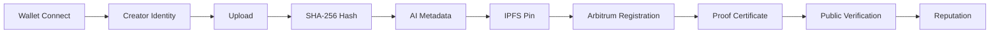
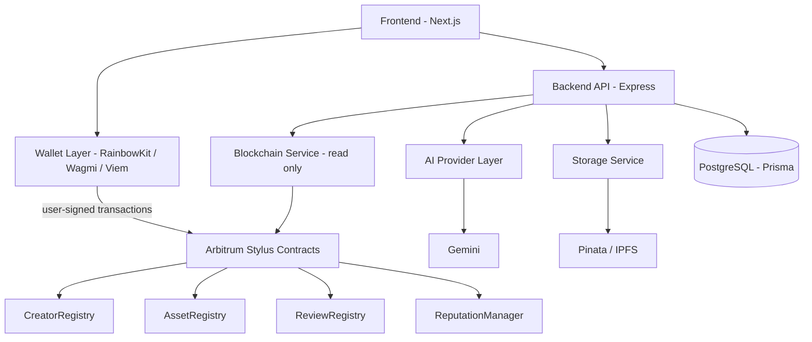

# OriginChain

**Own Your Creativity. Prove Your Origin.**

A decentralized creator identity and proof-of-origin platform built on Arbitrum. Creators register digital and physical works on-chain, generating a verifiable, independently-checkable record of authorship and timestamp.

[](LICENSE)
[-12aaff.svg)](docs/DEVELOPMENT_ROADMAP.md)
[](contracts/)
[](apps/frontend/package.json)
[](apps/frontend/package.json)
[](apps/backend/tsconfig.json)
[](apps/backend/package.json)
[](docs/DATABASE_SCHEMA.md)
[](apps/backend/prisma/schema.prisma)
[](apps/backend/src/services/ai/gemini.provider.ts)

---

## Overview

Creative work moves fast and is trivially copyable — a screenshot, a re-upload, a stripped-metadata reshare — and there's rarely a simple, public way to show *who put this out first, and when*. OriginChain gives creators a way to register a work's content hash on-chain at a specific moment, then lets anyone — no wallet, no account — independently verify that record later.

**What this is and isn't:** an OriginChain registration is a blockchain record of content hash + timestamp + creator address. It is **not** a legal determination of copyright ownership. As stated on every generated Proof of Origin Certificate: *"This certificate represents a blockchain registration of the referenced asset and associated metadata at the recorded timestamp. It is a shareable proof artifact, not a legal claim of copyright ownership."* Independent verification is always available through the platform itself.

## How It Works

<div align="center">
<br/>



<br/>
</div>

1. A creator connects a wallet and registers a **Creator Identity** (on-chain + off-chain profile).
2. They upload a file. The **exact bytes** are hashed client-side with SHA-256 before anything leaves the browser.
3. An AI layer suggests title/description/tags for the asset, which the creator reviews and can edit.
4. The asset and its metadata are pinned to **IPFS**.
5. The content hash, IPFS CID, and metadata CID are registered on **Arbitrum** via the creator's own signed transaction.
6. A **Proof of Origin Certificate** (PDF, with QR code) is generated for sharing.
7. Anyone can independently **verify** the asset later — no wallet required.
8. Creator activity (assets registered, reviews received) feeds a **Reputation** score.

## Core Features

Verified directly against the current backend routes and services — see linked source for each group.

**Creator Identity**
- Wallet-based profile creation and editing ([`creator.routes.ts`](apps/backend/src/routes/creator.routes.ts))
- Public creator profile pages, lookup by wallet address
- AI-assisted activity insights on the creator dashboard

**Proof of Origin**
- Client-side SHA-256 content hashing before upload
- Asset registration flow: upload → AI metadata → IPFS pin → on-chain confirmation ([`asset.routes.ts`](apps/backend/src/routes/asset.routes.ts))
- Proof of Origin Certificate generation (PDF with QR verification code)
- Tag-based search: assets can be found by title or by their registered tags

**AI**
- AI-generated metadata suggestions (title, description, tags) at upload time, via the Gemini provider — always creator-reviewable/editable before confirmation, never auto-committed on-chain
- AI-assisted summaries on creator dashboards

**Verification**
- Public, wallet-free verification by proof ID or content hash ([`GET /assets/verify`](apps/backend/src/routes/asset.routes.ts))
- Clear match / no-match result showing on-chain timestamp and creator

**Community / Reputation**
- Reviews on registered assets, restricted to other registered creators ([`review.routes.ts`](apps/backend/src/routes/review.routes.ts))
- Aggregate creator reputation score, backed by an on-chain `ReputationManager`

**Organizations & Admin**
- Organization creation and management — an organization owner can create an org and view/manage it ([`organization.routes.ts`](apps/backend/src/routes/organization.routes.ts): create, view own, view by ID, update)
- Admin analytics dashboard (`GET /admin/analytics`) — platform-wide stats, gated behind an env-configured admin allowlist (`ADMIN_WALLET_ADDRESSES`), not a database role ([`admin.routes.ts`](apps/backend/src/routes/admin.routes.ts), [`adminAuth.ts`](apps/backend/src/middleware/adminAuth.ts))

## Architecture

<div align="center">
<br/>



<br/>
</div>

Six layers, each with a distinct job:

- **Frontend** (Next.js) — the creator- and visitor-facing app: wallet connect, upload, browsing, verification, dashboards. It calls the Backend API for everything off-chain, but signs and broadcasts on-chain transactions itself through the Wallet Layer — the backend never holds a private key or signs on a creator's behalf.
- **Backend API** (Express) — owns everything that isn't a user-signed transaction: auth, validation, AI metadata generation, IPFS pinning, and syncing chain state into Postgres for fast queries. It's the coordination point between the off-chain world and the on-chain world, but never initiates a transaction itself.
- **AI Provider Layer** (`apps/backend/src/services/ai/`) — isolates the Gemini integration behind a provider interface rather than calling the SDK directly from route handlers, so the underlying model or vendor can change without touching call sites. AI-suggested metadata is always creator-reviewable before anything is pinned or registered.
- **Storage Service** (`apps/backend/src/services/storage/`) — wraps IPFS pinning (via Pinata) behind a provider interface for the same reason as the AI layer, and handles pinning both the asset file and its metadata JSON.
- **Blockchain Service** (`apps/backend/src/services/blockchain/`) — centralizes all backend-to-contract interaction: reads, event/log decoding, chain-error translation. It's deliberately **read-only** — no route handler or other service calls a contract directly, and there is no server-side transaction signing; all user-initiated transactions are signed and broadcast from the frontend wallet.
- **Database** (PostgreSQL via Prisma) — not the source of truth (the chain and IPFS are); it's an index/cache layer that makes on-chain and off-chain data queryable and fast — creator profiles, indexed asset records, reviews, reputation scores, tags, and organizations.

Full architecture diagrams and layer-by-layer detail: [`docs/DEVELOPER_KICKOFF_BLUEPRINT.md`](docs/DEVELOPER_KICKOFF_BLUEPRINT.md).

## Tech Stack

Read directly from [`apps/frontend/package.json`](apps/frontend/package.json) and [`apps/backend/package.json`](apps/backend/package.json).

**Frontend** — Next.js 16, React 19, TypeScript, Tailwind CSS, shadcn/ui + Base UI, Framer Motion, visx (charts). Wallet stack: **RainbowKit + Wagmi + Viem**.

**Backend** — Express 5, TypeScript, Prisma 7 + PostgreSQL, Zod validation, SIWE (Sign-In With Ethereum), JWT sessions. AI: **`@google/genai` (Gemini)**. Storage: Pinata (IPFS). Certificates: `pdf-lib` + `qrcode`.

**Smart Contracts** — Rust, via **Arbitrum Stylus**.

> Note: the AI provider is **Gemini**, not OpenAI — earlier project descriptions referencing OpenAI are outdated.

## Repository Structure

A monorepo managed with pnpm workspaces:

- `apps/` — `frontend` (Next.js) and `backend` (Express) applications
- `contracts/` — the four Arbitrum Stylus (Rust) contracts
- `packages/` — shared TypeScript types and config across apps
- `docs/` — engineering documentation (architecture, API, schema, roadmap)
- `scripts/` — operational/deployment scripts

Full annotated tree, kept in sync with the real implementation: [`docs/REPOSITORY_STRUCTURE.md`](docs/REPOSITORY_STRUCTURE.md).

## Getting Started

### Prerequisites
- Node.js ≥ 20
- pnpm 9
- A local PostgreSQL instance
- A Pinata account (IPFS pinning) and a Gemini API key ([aistudio.google.com/apikey](https://aistudio.google.com/apikey))

### Setup

```bash
git clone <repo-url>
cd originchain
pnpm install
```

Copy the env templates and fill in real values:

```bash
cp apps/backend/.env.example apps/backend/.env
cp apps/frontend/.env.example apps/frontend/.env.local
```

**Backend** (`apps/backend/.env`) — see [`.env.example`](apps/backend/.env.example) for the authoritative list:
`DATABASE_URL`, `JWT_SECRET`, `SESSION_TOKEN_EXPIRY`, `APP_DOMAIN`, `FRONTEND_URL`, `PINATA_JWT`, `PINATA_GATEWAY_URL`, `GEMINI_API_KEY`, `ADMIN_WALLET_ADDRESSES`, `RPC_URL`.

**Frontend** (`apps/frontend/.env.local`) — see [`.env.example`](apps/frontend/.env.example):
`NEXT_PUBLIC_WALLETCONNECT_PROJECT_ID`, `NEXT_PUBLIC_API_URL`.

### Database

```bash
cd apps/backend
pnpm prisma migrate dev
pnpm prisma generate
```

### Run

There is no root-level command that runs both apps together — run each app separately, in two terminals:

```bash
# Terminal 1
pnpm --filter backend dev
# or: cd apps/backend && pnpm dev

# Terminal 2
pnpm --filter frontend dev
# or: cd apps/frontend && pnpm dev
```

Backend defaults to `http://localhost:4000`, frontend to `http://localhost:3000`.

## Development Commands

Exactly what's defined in each `package.json` — nothing else exists today.

**Root** ([`package.json`](package.json)):
| Command | What it does |
|---|---|
| `pnpm dev:frontend` | Runs the frontend dev server (`pnpm --filter frontend dev`) |
| `pnpm dev:backend` | Runs the backend dev server (`pnpm --filter backend dev`) |
| `pnpm build` | Builds all workspace packages (`pnpm -r build`) |
| `pnpm lint` | Lints all workspace packages (`pnpm -r lint`) |
| `pnpm format` | Formats the repo with Prettier |

**`apps/backend`**: `dev` (tsx watch), `build` (tsc), `start` (run compiled output).
**`apps/frontend`**: `dev` (next dev), `build` (next build), `start` (next start), `lint` (eslint).

There is currently no root `pnpm dev` that runs both apps concurrently, and no `test` script in any workspace.

## Smart Contracts

Four Rust contracts, deployed via Arbitrum Stylus:

- **CreatorRegistry** — on-chain anchor linking a wallet address to a registered creator record
- **AssetRegistry** — the core proof-of-origin contract; binds a content hash to a creator address and timestamp, immutably
- **ReviewRegistry** — records reviews between registered creators on registered assets
- **ReputationManager** — aggregates asset and review activity into a creator reputation score

Full interface definitions, storage layout, events, and access control: [`docs/SMART_CONTRACT_INTERFACES.md`](docs/SMART_CONTRACT_INTERFACES.md), which also documents a real **Known Deviations** section from a post-implementation audit against the original interface spec.

## Documentation

- [`docs/API_SPECIFICATION.md`](docs/API_SPECIFICATION.md) — full REST API reference
- [`docs/DATABASE_SCHEMA.md`](docs/DATABASE_SCHEMA.md) — Postgres schema and ERD
- [`docs/DEVELOPER_KICKOFF_BLUEPRINT.md`](docs/DEVELOPER_KICKOFF_BLUEPRINT.md) — architecture and layer-by-layer design
- [`docs/DEVELOPMENT_ROADMAP.md`](docs/DEVELOPMENT_ROADMAP.md) — phase-by-phase build history and current status
- [`docs/METADATA_SCHEMA_VERSIONS.md`](docs/METADATA_SCHEMA_VERSIONS.md) — versioning for pinned IPFS metadata
- [`docs/PROJECT_CHECKLIST.md`](docs/PROJECT_CHECKLIST.md) — implementation checklist
- [`docs/REPOSITORY_STRUCTURE.md`](docs/REPOSITORY_STRUCTURE.md) — full annotated monorepo layout
- [`docs/SMART_CONTRACT_INTERFACES.md`](docs/SMART_CONTRACT_INTERFACES.md) — contract interfaces and known deviations
- [`docs/TEAM_TASK_DISTRIBUTION.md`](docs/TEAM_TASK_DISTRIBUTION.md) — team ownership and parallelization notes

## Security & Trust Model

- **Wallet authentication** via SIWE (Sign-In With Ethereum) — no passwords, session backed by a JWT issued after signature verification.
- **Content-hash integrity** is the core guarantee: the SHA-256 hash computed client-side, the hash registered on-chain, and the content pinned to IPFS all correspond to the exact same bytes — anyone can recompute the hash from the IPFS content and compare it to the on-chain record.
- **Immutable registration** — once an asset's hash is registered on `AssetRegistry`, it cannot be altered; a hash collision on registration reverts, which is the entire duplicate-prevention mechanism.
- **IPFS content addressing** — pinned content is addressed by its own hash (CID), so the storage layer can't silently swap content out from under a registration.

For vulnerability reporting, see [`SECURITY.md`](SECURITY.md).

## Roadmap

Development is organized into 14 phases; current status is tracked live in [`docs/DEVELOPMENT_ROADMAP.md`](docs/DEVELOPMENT_ROADMAP.md). As of this writing, Phases 0–11 (foundation through security hardening, including Organizations/Admin and AI features) are complete; **Phase 12 (Design & Polish)** and **Phase 13 (Deployment)** are not yet started.

> **Current deployment target is Arbitrum Sepolia (testnet) only.** No contract in this repository is deployed to Arbitrum mainnet, and nothing here should be treated as production/mainnet-ready.

## Contributing

Contributions follow a feature-branch workflow off `dev`, conventional commit prefixes (`feat:`, `fix:`, `docs:`, `refactor:`, `chore:`), and strict secret hygiene. Full guide: [`CONTRIBUTING.md`](CONTRIBUTING.md).

## Team

| Name | GitHub | LinkedIn |
|---|---|---|
| Dhyey | [@dhyeydaftary](https://github.com/dhyeydaftary) | [in/dhyey-daftary](https://www.linkedin.com/in/dhyey-daftary/) |
| Nandish | [@nandishpatel4647](https://github.com/nandishpatel4647) | [in/nandish-patel-aiml](https://www.linkedin.com/in/nandish-patel-aiml/) |
| Frenil | [@frenilpatel67](https://github.com/frenilpatel67) | [in/frenil-patel-1b820034a](https://www.linkedin.com/in/frenil-patel-1b820034a/) |

## License

Licensed under the **Apache License 2.0** (see [`LICENSE`](LICENSE)).
=======
# originchain
Decentralized creator identity &amp; proof-of-origin platform on Arbitrum
