# OriginChain — Database Schema (PostgreSQL)

PostgreSQL here is an **index and cache layer**, not the source of truth. Every table that mirrors on-chain data includes the on-chain identifier it was derived from, so state can always be reconciled by replaying contract events.

## Entity-Relationship Diagram

```mermaid
erDiagram
    CREATORS ||--o{ ASSETS : owns
    CREATORS ||--o{ REVIEWS : writes
    CREATORS ||--|| REPUTATION_SCORES : has
    ASSETS ||--o{ REVIEWS : receives
    ASSETS ||--o{ ASSET_TAGS : tagged_with
    TAGS ||--o{ ASSET_TAGS : applied_to
    ORGANIZATIONS ||--o{ CREATORS : employs
    CREATORS ||--o{ ANALYTICS_EVENTS : generates

    CREATORS {
        uuid id PK
        string wallet_address
        string display_name
        string bio
        string avatar_cid
        uuid organization_id FK
        timestamp created_at
    }
    ASSETS {
        uuid id PK
        uuid creator_id FK
        string content_hash
        string ipfs_cid
        string metadata_cid
        string title
        string description
        string ai_generated_flag
        timestamp registered_at
        string tx_hash
    }
    REVIEWS {
        uuid id PK
        uuid asset_id FK
        uuid reviewer_creator_id FK
        int rating
        string comment
        string tx_hash
        timestamp created_at
    }
    REPUTATION_SCORES {
        uuid creator_id PK, FK
        int score
        int asset_count
        int review_count
        timestamp last_updated
    }
    TAGS {
        uuid id PK
        string name
        string source
    }
    ASSET_TAGS {
        uuid asset_id FK
        uuid tag_id FK
    }
    ORGANIZATIONS {
        uuid id PK
        string name
        string wallet_address
        timestamp created_at
    }
    ANALYTICS_EVENTS {
        uuid id PK
        uuid creator_id FK
        string event_type
        jsonb metadata
        timestamp occurred_at
    }
```

## Table Definitions

### `creators`
| Column | Type | Constraints |
|---|---|---|
| id | uuid | PK, default gen_random_uuid() |
| wallet_address | varchar(42) | unique, not null, indexed |
| display_name | varchar(100) | not null |
| bio | text | nullable |
| avatar_cid | varchar(100) | nullable — IPFS CID |
| organization_id | uuid | FK → organizations.id, nullable |
| created_at | timestamptz | not null, default now() |

Indexed on `wallet_address` (primary lookup path for auth and profile pages).

### `assets`
| Column | Type | Constraints |
|---|---|---|
| id | uuid | PK |
| creator_id | uuid | FK → creators.id, not null, indexed |
| content_hash | varchar(66) | unique, not null, indexed — the verifiable proof-of-origin hash |
| ipfs_cid | varchar(100) | not null — points to the pinned asset file |
| metadata_cid | varchar(100) | not null — points to pinned metadata JSON |
| title | varchar(200) | not null |
| description | text | nullable |
| ai_generated_flag | boolean | default false — true if metadata originated from AI suggestion |
| registered_at | timestamptz | not null |
| tx_hash | varchar(66) | not null — on-chain registration transaction |

Indexed on `content_hash` (verification lookups) and `creator_id` (portfolio pages).

### `reviews`
| Column | Type | Constraints |
|---|---|---|
| id | uuid | PK |
| asset_id | uuid | FK → assets.id, not null, indexed |
| reviewer_creator_id | uuid | FK → creators.id, not null |
| rating | smallint | not null, check (rating between 1 and 5) |
| comment | text | nullable |
| tx_hash | varchar(66) | not null |
| created_at | timestamptz | not null, default now() |

Unique constraint on `(asset_id, reviewer_creator_id)` — one review per reviewer per asset, mirroring the anti-sybil rule enforced on-chain in `ReviewRegistry`.

### `reputation_scores`
| Column | Type | Constraints |
|---|---|---|
| creator_id | uuid | PK, FK → creators.id |
| score | integer | not null, default 0 |
| asset_count | integer | not null, default 0 |
| review_count | integer | not null, default 0 |
| last_updated | timestamptz | not null |

One row per creator — a denormalized, fast-read cache of what `ReputationManager` computes on-chain.

### `tags` / `asset_tags`
Standard many-to-many. `tags.source` distinguishes `'ai'` vs `'creator'` origin, so the UI can visually flag AI-suggested tags.

### `organizations`
| Column | Type | Constraints |
|---|---|---|
| id | uuid | PK |
| name | varchar(150) | not null |
| wallet_address | varchar(42) | unique, nullable |
| created_at | timestamptz | not null |

### `analytics_events`
| Column | Type | Constraints |
|---|---|---|
| id | uuid | PK |
| creator_id | uuid | FK → creators.id, indexed |
| event_type | varchar(50) | not null — e.g. `asset_view`, `verification_attempt`, `profile_view` |
| metadata | jsonb | nullable — flexible event payload |
| occurred_at | timestamptz | not null, indexed |

Append-only event log powering `API_SPECIFICATION.md`'s analytics endpoints. `jsonb` keeps this table schema-flexible as new event types are added without migrations.

## Future-Ready Tables (Not Implemented Now)

These are documented for planning purposes only — no migration should be written for them until the corresponding feature is actively built.

### `notifications`
Purpose: in-app/email notifications (e.g. "your asset was reviewed," "verification milestone reached"). Would need `creator_id`, `type`, `payload jsonb`, `read_at`, `created_at`. Deferred until there's an actual delivery mechanism (email service or in-app inbox) to justify it.

### `verification_logs`
Purpose: audit trail of every public verification attempt (`GET /assets/verify` calls) — useful later for analytics ("this asset has been verified 500 times") and abuse detection. Would need `content_hash`, `matched boolean`, `ip_hash`, `occurred_at`. Deferred because `analytics_events` can absorb this need in the short term via `event_type: 'verification_attempt'`; a dedicated table is only worth it once verification volume is high enough to need different retention/indexing than general analytics.

### `audit_logs`
Purpose: administrative action trail (profile edits by admins, disputes resolved, manual data corrections) — important once the platform has real users and needs accountability for privileged actions. Would need `actor_id`, `action`, `target_type`, `target_id`, `diff jsonb`, `created_at`. Deferred until admin tooling beyond basic dashboards exists.

## Design Notes

- All foreign keys use `uuid`, not the wallet address, so internal relationships survive a creator changing their linked wallet in the future (a real product need, not just theory).
- `content_hash` uniqueness at the database level is a defense-in-depth check — the actual duplicate-prevention rule is enforced on-chain in `AssetRegistry`, but blocking here avoids a wasted indexer write on an impossible state.
- No cascading deletes on creator/asset relationships — proof-of-origin records should never be destructible, even off-chain. Use soft-delete flags if hiding content is ever needed.
- `assets.metadata_cid` points to a versioned JSON document (see `DEVELOPER_KICKOFF_BLUEPRINT.md` § Metadata Versioning Strategy). Postgres does not need its own `schema_version` column today — the version lives in the pinned JSON itself — but if metadata parsing logic ever needs to branch based on version without re-fetching from IPFS, a `metadata_version smallint` column can be added to `assets` as a cache of that same value.
