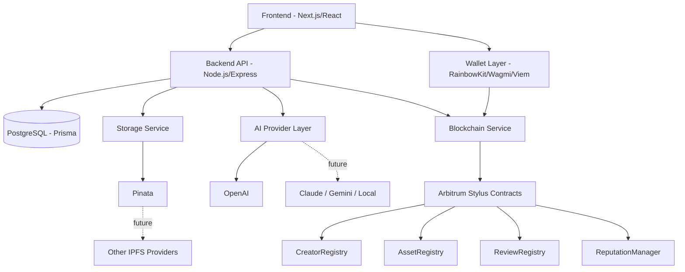
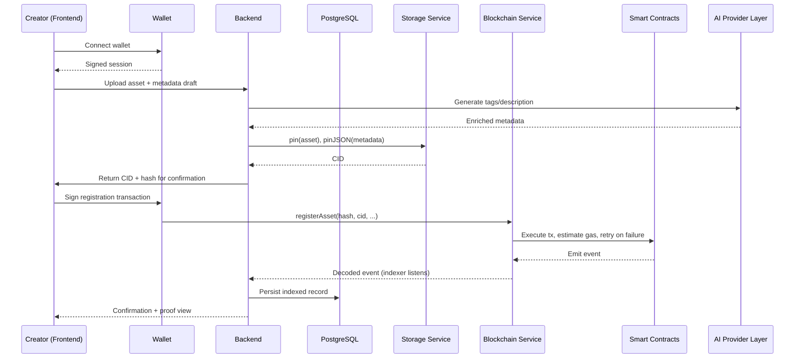

# OriginChain — Developer Kickoff Blueprint

**Own Your Creativity. Prove Your Origin.**

This is the master engineering reference for OriginChain. It defines the architecture, repository layout, conventions, and build order the team follows from Day 0. Every other document in `docs/` expands on a section here.

---

## 1. Project Overview

### Technical Summary

OriginChain is a decentralized creator identity and proof-of-origin platform built on Arbitrum. Creators register digital and physical creative works on-chain, producing verifiable proof of authorship, ownership, and timestamp. The system pairs on-chain registries (Arbitrum Stylus, written in Rust) with an off-chain layer (IPFS for media/metadata, PostgreSQL for indexing/search/caching) and an AI layer for automatic metadata generation, tagging, and analytics.

### High-Level Architecture



### Core Modules

| Module | Responsibility |
|---|---|
| Frontend | Creator, visitor/collector, org, and admin-facing screens (16 total) |
| Wallet Layer | Wallet connect, signing, chain management |
| Backend API | Business logic, validation, auth, orchestration — never touches contracts or Pinata directly |
| Blockchain Service | Sole owner of contract addresses, ABIs, tx execution, gas estimation, event decoding, retries, chain validation |
| Storage Service | Sole owner of pinning/retrieval; currently backed by Pinata, abstracted so providers can be swapped |
| Database | Search index, cached on-chain state, off-chain relational data |
| AI Provider Layer | Pluggable metadata/tag/description/analytics generation; currently backed by OpenAI |
| Smart Contracts | Source of truth for identity, ownership, reviews, reputation |

### Why these two service layers matter

**Blockchain Service.** Today the backend calls contracts directly, which means contract addresses, ABI wiring, and retry/error handling are scattered across route handlers. Centralizing this into one service gives you one place to update when a contract redeploys, one place to standardize gas estimation and retry-on-failure logic, and one place to translate raw chain errors (reverts, nonce issues) into the API's error shape. This costs almost nothing to set up now and saves a painful refactor later.

**Storage Service.** Same rationale for IPFS: today `ipfs.service.ts` is really "Pinata service." Wrapping it behind a `StorageService` interface (`pin(file)`, `pinJSON(obj)`, `retrieve(cid)`) means swapping or adding a second pinning provider later is a one-file change, not a search-and-replace across the codebase. This is a thin interface, not new infrastructure — it doesn't slow down hackathon delivery.

### Development Philosophy

- **On-chain for trust, off-chain for speed.** Anything that must be tamper-proof (ownership, timestamps, hashes) lives on-chain. Anything that needs to be fast or mutable (search, previews, drafts) lives off-chain.
- **Hackathon speed without throwaway architecture.** Every shortcut taken for the hackathon should be a subset of the production path, not a diversion from it.
- **Contracts are the API contract.** Frontend and backend are built against interfaces defined in `SMART_CONTRACT_INTERFACES.md` before contracts are finished, using mocks.

---

## 2. Repository Structure

See `REPOSITORY_STRUCTURE.md` for the full annotated tree. Summary:

```
originchain/
├── apps/
│   ├── frontend/
│   └── backend/
├── contracts/
│   ├── creator-registry/
│   ├── asset-registry/
│   ├── review-registry/
│   └── reputation-manager/
├── packages/
│   ├── shared-types/
│   └── config/
├── docs/
├── scripts/
└── .github/
```

**Monorepo, npm/pnpm workspaces for JS packages, Cargo workspace for contracts.** Chosen over polyrepo because a 3-person team needs single-PR atomic changes across frontend/backend/shared types, and doesn't yet have the scale where independent repo lifecycles pay off.

---

## 3. Complete System Architecture

### Data Flow



### Layer Interactions

`Frontend → Wallet → Backend → Database → IPFS → Blockchain → Verification → Analytics`

- **Frontend → Wallet:** RainbowKit handles connection UX; Wagmi/Viem handle typed contract calls and signing.
- **Backend → Database:** Prisma ORM against PostgreSQL, used purely as an index/cache — never the source of truth for ownership.
- **Backend → IPFS:** Pinata SDK pins content, returns CIDs stored both on-chain (hash reference) and in Postgres (for fast lookup).
- **Backend → Blockchain:** An event indexer (long-running worker or scheduled job) listens to contract events and reconciles Postgres state — this is what makes search/browsing fast without querying the chain directly.
- **Verification:** Any party can independently recompute a file hash and compare it to the on-chain record — this is the actual "proof of origin," and must never depend on the backend being trusted.
- **Analytics:** AI layer and backend aggregate indexed data for creator/org dashboards.

---

## 4. User Flow

### Wallet Connection
Connect (RainbowKit modal) → sign a nonce/message for session auth → backend issues a session token tied to the wallet address.

### Creator Onboarding
Connect wallet → create profile (display name, bio, avatar) → optional social/domain verification → profile stored off-chain in Postgres, optionally anchored on-chain via `CreatorRegistry`.

### Profile Creation
Form submission → validation → avatar/media pinned to IPFS → `CreatorRegistry.registerCreator()` call → indexed.

### Asset Upload → Hash Generation → Metadata Creation → IPFS Upload
1. File selected client-side.
2. Client computes a content hash (e.g. SHA-256) before upload, shown to the user as a preview of what will be registered.
3. AI layer suggests title/tags/description; creator can edit.
4. Backend pins asset + finalized metadata JSON (tagged with a `version`/`schema` field — see Metadata Versioning below) via the Storage Service, returns CID.

### Smart Contract Interaction
Creator reviews hash + CID → signs `AssetRegistry.registerAsset(hash, cid, metadataURI)` → transaction confirmed → event indexed into Postgres.

### Verification
Any visitor can input a file (or reference an asset page) → client recomputes hash → compares against `AssetRegistry` on-chain record → match/no-match displayed with the on-chain timestamp and creator address.

### Proof of Origin Certificate
Immediately after a successful `AssetRegistry` registration, the backend generates a shareable **Proof of Origin Certificate** — a rendered (PDF or image) document containing the creator, wallet address, asset title, timestamp, content hash, metadata CID, transaction hash, and a QR code linking to the public verification page for that asset. This sits in the backend as a lightweight rendering step triggered by `POST /assets/confirm` succeeding — it reads data already persisted, no new data model required. Primarily a demo/presentation feature (judges and early users can immediately see and share a tangible artifact), but it doubles as a genuinely useful shareable proof for real creators.

### Reviews
Verified collectors/visitors submit reviews against `ReviewRegistry`, tied to wallet address to prevent spam/sybil review stuffing (subject to reputation-weighted display).

### Reputation
`ReputationManager` aggregates signals (asset count, verified reviews, dispute history) into a queryable score, cached in Postgres for fast display, recomputed on-chain periodically or on key events.

### Analytics
Backend/AI layer aggregate views, verifications, review sentiment, and reputation trends into creator and admin dashboards.

---

## 5. Folder Responsibilities

| Folder | Responsibility |
|---|---|
| `apps/frontend` | All 16 UI screens, wallet integration, client-side hashing |
| `apps/backend` | REST API, request validation, business logic; delegates all chain calls to the Blockchain Service and all pinning to the Storage Service |
| `contracts/*` | One Cargo package per Stylus contract, isolated and independently testable |
| `packages/shared-types` | TypeScript types shared between frontend/backend (API contracts, contract ABI types) |
| `packages/config` | Shared lint/tsconfig/env schema |
| `docs` | This kickoff pack, architecture diagrams, ADRs |
| `scripts` | One-off deployment/indexer/migration scripts |
| `.github` | Reserved for later (issue templates, workflows) — out of scope for this pack |

---

## 6. Metadata Versioning Strategy

Every metadata JSON pinned to IPFS (asset metadata and, later, profile metadata) includes:

```json
{
  "version": 1,
  "schema": "originchain.asset.v1",
  "title": "...",
  "description": "...",
  "tags": ["..."],
  "aiGenerated": true
}
```

- **`version`** is an integer, bumped whenever the schema's field set changes.
- **`schema`** is a stable string identifier (`originchain.asset.v1`, `originchain.profile.v1`) the backend uses to pick the correct parser.
- The backend's metadata parser is written to read `schema`/`version` first and dispatch to the matching parsing logic — older assets are never broken by a newer schema, since their pinned JSON is immutable and self-describes its own version.
- New optional fields can be added within the same version without a bump; a version bump is only required for breaking changes (renamed/removed fields, changed types).

This costs one extra field per JSON document today and prevents a full data-migration problem later, since IPFS content is immutable — you cannot "migrate" already-pinned metadata, only teach the reader to understand multiple versions.

## 7. Environment Strategy

- **Never commit secrets.** `.env` files are gitignored; `.env.example` files (committed) document required keys with placeholder values.
- **Per-app env files.** `apps/frontend/.env.local`, `apps/backend/.env`, `contracts/.env` (deployer key, RPC URL) — kept separate so a leaked frontend env can't expose backend/deployer secrets.
- **Shared constants** (contract addresses per network, chain IDs) live in `packages/shared-types/constants.ts`, generated/updated after each deployment — single source of truth for both frontend and backend.
- **Secrets required:** OpenAI API key (AI Provider Layer), Pinata API key/secret (Storage Service), PostgreSQL connection string, Arbitrum RPC URL and deployer private key (Blockchain Service — test wallet only, never a real-funds wallet), JWT signing secret (session auth), Railway/Vercel deploy tokens (CI, later phase).
- **Secret handling practices:** load secrets via `process.env` only, never hard-code; validate presence of required env vars at process startup (fail fast, not on first request); never log secret values, even in error traces; rotate the JWT signing secret and any test-wallet key immediately if a laptop or repo is ever compromised.

---

## 8. Development Guidelines

### Naming Conventions
- **Files:** `kebab-case` for folders and non-component files, `PascalCase` for React components, `snake_case` for Rust.
- **Contracts:** PascalCase contract names matching the four registries exactly (`CreatorRegistry`, not `Creator_Registry`).
- **Database:** `snake_case` table/column names (Prisma convention), plural table names.
- **API routes:** `kebab-case`, versioned under `/api/v1/`.

### Folder Conventions
- No cross-imports between `apps/frontend` and `apps/backend` — only through `packages/shared-types`.
- Each Stylus contract is a self-contained Cargo crate with its own tests.

### Coding Conventions
- TypeScript strict mode everywhere in `apps/` and `packages/`.
- Rust: `cargo fmt` + `cargo clippy` clean before merge (even without CI enforcing it yet, treat it as a personal gate).
- No `any` in TypeScript without an inline comment justifying it.

### Git Conventions
- Conventional commits (`feat:`, `fix:`, `docs:`, `chore:`) — even solo/small-team, this keeps history scannable as you scale.
- Full branching/PR workflow is intentionally deferred to the next phase (per project scope) — for now, treat `main` as protected-by-convention: pull before push, communicate before force-pushing.

### Best Practices
- Client-side hash computation before any upload, always shown to the user — this is the trust anchor of the whole product; never let the backend be the only party that knows the hash.
- Treat AI-generated metadata as a **suggestion**, always editable, never auto-submitted to the chain without creator confirmation.
- Index worker must be idempotent (safe to replay events) — blockchain reorgs and worker restarts will happen.

---

## 9. Security Hardening (Practical, Hackathon-Compatible)

These are all low-effort additions that meaningfully raise the baseline without slowing delivery:

| Measure | What it does | Effort |
|---|---|---|
| Helmet | Sets sane security headers (X-Frame-Options, X-Content-Type-Options, etc.) on every Express response | One middleware line |
| Content Security Policy | Restricts what scripts/styles/frames can load in the frontend, reduces XSS blast radius | One config block |
| CORS policy | Explicit allow-list (frontend origin only), not `*` | One config block |
| Request logging | Structured logs (method, path, status, latency) for every request — critical for debugging demo-day issues fast | A logging middleware |
| Upload size limits | Enforced at the Express body-parser/multer layer, not just documented | Config option |
| MIME validation | Verify actual file content type, not just the extension, before pinning | A small validator util |
| Image validation | Re-encode/validate uploaded images before pinning, to strip malformed or malicious payloads | Library-based (e.g. `sharp`) |
| Wallet nonce expiration | `/auth/nonce` nonces expire after a short window (e.g. 5 minutes) | A timestamp check |
| Replay attack protection | Each nonce is single-use — invalidated immediately after successful `/auth/verify` | A DB/Redis flag |
| Environment secret handling | Per Environment Strategy above — fail-fast validation, no logging of secrets | Startup check |

None of these require new infrastructure — they're config and small utility functions layered onto the existing Express/Next.js setup.

## 10. Future Scope (Explicitly Postponed)

The following are recognized as valuable but are **intentionally out of scope** for the hackathon build, to keep delivery focused:

- **Similarity/duplicate detection** — perceptual hashing or embedding-based near-duplicate detection for uploaded assets (distinct from exact-hash duplicate prevention, which `AssetRegistry` already handles).
- **Multi-chain support** — deploying beyond Arbitrum; would require abstracting the Blockchain Service further to be chain-agnostic.
- **ERC-1155 editions** — support for multi-edition/limited-run assets rather than 1-of-1 registration.
- **ERC-2981 royalties** — on-chain royalty enforcement for secondary sales.
- **Advanced AI recommendations** — personalized discovery/recommendation engines beyond metadata generation and analytics summaries.

These are natural extensions of the current architecture (the service-layer abstractions introduced in this revision — Blockchain Service, Storage Service, AI Provider Layer — are specifically what make each of these addable later without a rewrite), but none are required for a working, demo-ready proof-of-origin platform.

## 11. Recommended Development Order

1. **Repository & tooling scaffold** (workspaces, shared-types package, env schema)
2. **Contract interfaces + local Stylus dev environment** (no logic yet — just compiling stubs)
3. **Database schema + Prisma models**
4. **Wallet auth flow** (frontend + backend session)
5. **CreatorRegistry contract + creator profile flow end-to-end**
6. **IPFS pinning integration**
7. **AssetRegistry contract + asset registration flow end-to-end**
8. **Verification flow** (public, no-wallet-required page)
9. **ReviewRegistry + ReputationManager**
10. **AI metadata layer**
11. **Analytics dashboards**
12. **Polish, remaining screens, deployment prep**

Rationale: get one full vertical slice (wallet → creator profile) working end-to-end before touching assets — this de-risks the wallet/contract/indexer integration early, when it's cheapest to fix.

See `DEVELOPMENT_ROADMAP.md` for phased timing and dependencies.
