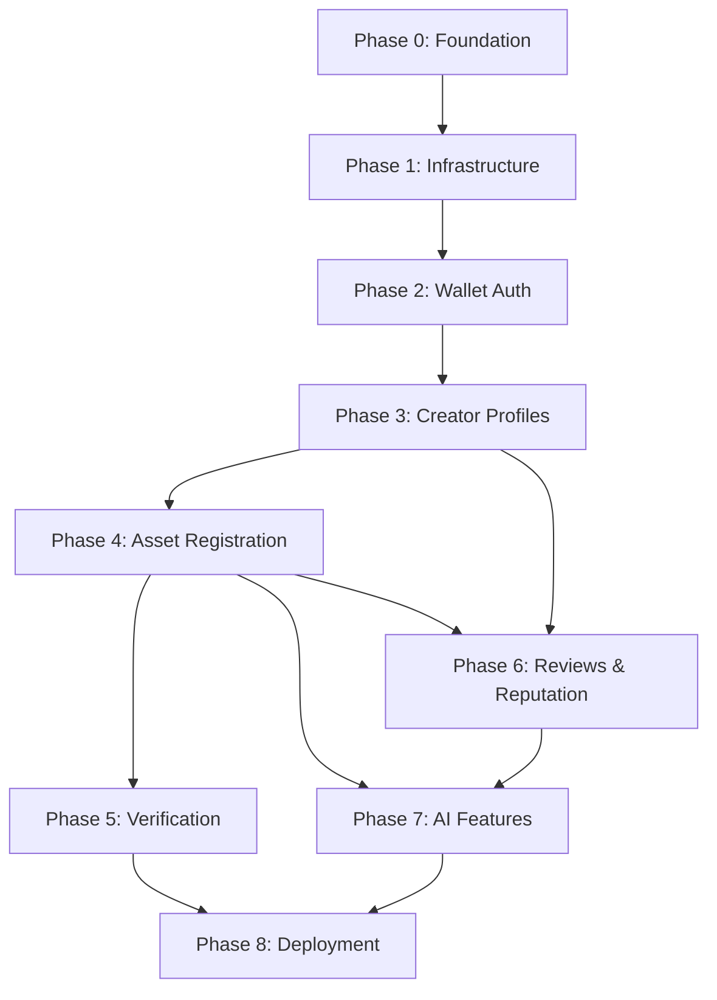

# OriginChain — Development Roadmap

Eight phases, ordered by dependency. Each phase lists its goal, deliverables, dependencies, and what "done" means.

---

## Phase 0 — Foundation

**Goal:** A working, empty scaffold every developer can build on without setup friction.

**Deliverables:**
- Monorepo structure per `REPOSITORY_STRUCTURE.md`
- `packages/shared-types` and `packages/config` initialized
- `.env.example` files in place
- Local dev instructions runnable by all 3 devs

**Dependencies:** None — this is the starting point.

**Completion Criteria:** All 3 developers can `git clone`, install, and run frontend + backend locally with placeholder pages/endpoints.

---

## Phase 1 — Infrastructure

**Goal:** Core plumbing — database, IPFS, local contract dev environment — all reachable.

**Deliverables:**
- PostgreSQL schema migrated (per `DATABASE_SCHEMA.md`)
- Pinata integration verified (pin + retrieve round-trip)
- Local Stylus dev environment running, contracts compiling as stubs

**Dependencies:** Phase 0.

**Completion Criteria:** A test file can be pinned to IPFS and retrieved; Prisma can read/write to Postgres; a stub contract deploys to a local/test node.

---

## Phase 2 — Wallet Authentication

**Goal:** End-to-end wallet-based session auth.

**Deliverables:**
- RainbowKit/Wagmi/Viem wired into frontend
- `/auth/nonce` + `/auth/verify` backend endpoints
- Session persistence in frontend

**Dependencies:** Phase 0 (scaffold), Phase 1 (backend running).

**Completion Criteria:** A user can connect a wallet, sign a message, and reach an authenticated frontend state backed by a real session token.

---

## Phase 3 — Creator Profiles

**Goal:** First full vertical slice: wallet → contract → database → UI.

**Deliverables:**
- `CreatorRegistry` implemented and deployed to testnet
- Creator profile creation/edit flow (frontend + backend)
- Indexer worker reconciling `CreatorRegistered` events into Postgres

**Dependencies:** Phase 1 (infra), Phase 2 (auth).

**Completion Criteria:** A creator can connect a wallet, submit a profile, see it registered on-chain (testnet explorer), and see it reflected in the app via the indexer — without manual DB intervention.

---

## Phase 4 — Asset Registration

**Goal:** The core product feature — proof-of-origin registration.

**Deliverables:**
- `AssetRegistry` implemented and deployed
- Client-side hashing utility
- Asset upload → AI metadata suggestion → IPFS pin → on-chain registration flow, fully wired
- Asset portfolio/browse pages

**Dependencies:** Phase 3 (requires registered creators).

**Completion Criteria:** A registered creator can upload a file, see a computed hash, get AI-suggested metadata, edit it, and complete an on-chain registration that's queryable afterward.

---

## Phase 5 — Verification

**Goal:** Public, wallet-free proof verification — the trust-building feature for non-technical visitors and judges.

**Deliverables:**
- Public verification page (`/verify`)
- `GET /assets/verify` endpoint
- Clear match/no-match UI with on-chain timestamp + creator display

**Dependencies:** Phase 4 (requires registered assets to verify against).

**Completion Criteria:** Any visitor, without a wallet, can upload/reference a file and get an accurate verified/not-verified result referencing on-chain data.

---

## Phase 6 — Reviews & Reputation

**Goal:** Social trust layer on top of registered assets.

**Deliverables:**
- `ReviewRegistry` and `ReputationManager` implemented and deployed
- Review submission + display UI
- Reputation score display on creator profiles

**Dependencies:** Phase 4 (assets to review), Phase 3 (registered creators as reviewers).

**Completion Criteria:** A second registered creator can review an asset, and the reviewed creator's reputation score updates and displays correctly.

---

## Phase 7 — AI Features

**Goal:** Deepen the AI layer beyond basic tagging (already partially delivered in Phase 4).

**Deliverables:**
- Improved metadata generation prompt quality
- AI-assisted analytics summaries on creator dashboards
- Guardrails (cost limits, human-in-the-loop confirmation everywhere)

**Dependencies:** Phase 4 (basic AI integration exists), Phase 6 (data to summarize).

**Completion Criteria:** AI suggestions are consistently useful (qualitatively assessed by the team) and dashboards show AI-generated summaries alongside raw analytics.

---

## Phase 8 — Deployment

**Goal:** Stable, demo-ready deployed environment.

**Deliverables:**
- Backend deployed to Railway
- Frontend deployed to Vercel
- Contracts deployed to Arbitrum testnet (or mainnet, if ready and budget allows)
- Full smoke test across the deployed stack

**Dependencies:** All prior phases functionally complete.

**Completion Criteria:** The full flow — connect wallet → register creator → register asset → verify → review — works end-to-end on the publicly deployed URLs, matching local behavior.

---

## Phase Dependency Graph

