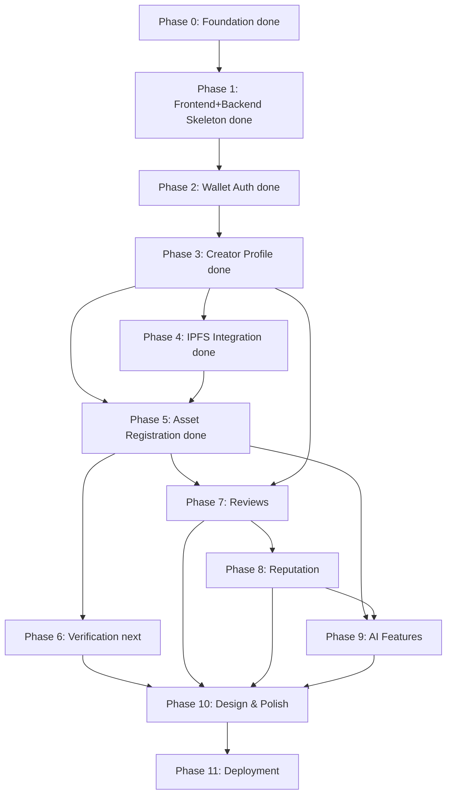

# OriginChain — Development Roadmap

Twelve phases, ordered by dependency, reflecting the revised implementation order adopted during Phase 0 kickoff (frontend/backend skeleton and wallet auth were moved earlier than in the original draft, since wallet auth is the foundation every other feature depends on) plus a dedicated Design & Polish phase added before deployment. Each phase lists its goal, deliverables, dependencies, and what "done" means.

**Status key:** ✅ Complete · 🔶 In Progress · ⬜ Not Started

---

## Phase 0 — Foundation ✅

**Goal:** A working, empty scaffold every developer can build on without setup friction.

**Deliverables:**
- Monorepo structure per `REPOSITORY_STRUCTURE.md`
- `packages/shared-types` and `packages/config` initialized
- `.env.example` files in place
- Local dev instructions runnable by all 3 devs
- Four Stylus contract skeletons compiling cleanly (interfaces only, no logic)

**Dependencies:** None — this is the starting point.

**Completion Criteria:** All 3 developers can `git clone`, install, and run frontend + backend locally with placeholder pages/endpoints. ✅ Met.

---

## Phase 1 — Frontend + Backend Skeleton ✅

**Goal:** Both apps installed, running, and reachable — no real screens or endpoints yet, just verified infrastructure.

**Deliverables:**
- Next.js + TypeScript + Tailwind + shadcn/ui + Framer Motion installed and verified (`apps/frontend`)
- Express + TypeScript + Prisma + PostgreSQL + Zod installed and verified (`apps/backend`)
- Local PostgreSQL connected, Prisma Client generation confirmed

**Dependencies:** Phase 0.

**Completion Criteria:** `pnpm dev` runs both apps cleanly; backend confirmed connected to a real local database. ✅ Met.

---

## Phase 2 — Wallet Authentication ✅

**Goal:** End-to-end wallet-based session auth — the foundation every other feature builds on.

**Deliverables:**
- RainbowKit/Wagmi/Viem wired into frontend, Arbitrum chains configured
- Wallet connect UI with cookie-based session persistence (no reload flash)
- SIWE (Sign-In With Ethereum) message signing flow
- `/auth/nonce` + `/auth/verify` backend endpoints, with single-use/expiring nonces and JWT session tokens
- CORS configured to allow the frontend origin

**Dependencies:** Phase 1.

**Completion Criteria:** A user can connect a wallet, sign a SIWE message, and reach an authenticated frontend state backed by a real session token that persists across reloads. ✅ Met.

---

## Phase 3 — Creator Profile ✅

**Goal:** First full vertical slice: wallet → contract → database → UI.

**Deliverables:**
- `CreatorRegistry` contract logic implemented (currently an empty compiling skeleton) + unit tests, deployed to Arbitrum Sepolia
- `creators` table in Prisma schema, migrated
- Creator profile creation/edit flow (frontend + backend)
- Indexer worker reconciling `CreatorRegistered` events into Postgres

**Dependencies:** Phase 2 (auth required to know who's creating a profile).

**Completion Criteria:** An authenticated creator can submit a profile, see it registered on-chain (testnet explorer), and see it reflected in the app via the indexer — without manual DB intervention.

---

## Phase 4 — IPFS Integration ✅

**Goal:** Off-chain storage layer working, ready for asset registration to build on.

**Deliverables:**
- Pinata account + API keys configured
- `Storage Service` (`services/storage/`) with Pinata provider implementation
- Pin-file and pin-JSON backend helpers
- CID retrieval verified via public gateway
- Metadata versioning (`version`/`schema` fields) applied to pinned JSON

**Dependencies:** Phase 3 (profile avatars are the first real use of pinning, even before assets).

**Completion Criteria:** A file and a JSON metadata document can each be pinned and retrieved round-trip through our backend, not just directly through Pinata's own tools.

---

## Phase 5 — Asset Registration ✅

**Goal:** The core product feature — proof-of-origin registration.

**Deliverables:**
- `AssetRegistry` contract logic implemented + unit tests, deployed
- Client-side content hashing utility
- Asset upload → AI metadata suggestion → IPFS pin → on-chain registration flow, fully wired
- Proof of Origin Certificate generation
- Asset portfolio/browse pages

**Dependencies:** Phase 3 (registered creators), Phase 4 (IPFS working).

**Completion Criteria:** A registered creator can upload a file, see a computed hash, get AI-suggested metadata, edit it, and complete an on-chain registration that's queryable afterward.

---

## Phase 6 — Verification 🔶 *(next up)*

**Goal:** Public, wallet-free proof verification — the trust-building feature for non-technical visitors and judges.

**Deliverables:**
- Public verification page (`/verify/:proofId`, with a `/verify` fallback supporting hash lookup too), no wallet required — must match the `/verify/{proofId}` URL already being encoded into Proof of Origin Certificate QR codes (Phase 5), not the originally-sketched `/verify?hash=...` query-param form
- `GET /assets/verify` endpoint
- Clear match/no-match UI with on-chain timestamp + creator display

**Dependencies:** Phase 5 (requires registered assets to verify against).

**Completion Criteria:** Any visitor, without a wallet, can upload/reference a file and get an accurate verified/not-verified result referencing on-chain data.

---

## Phase 7 — Reviews ⬜

**Goal:** Sybil-resistant review layer on registered assets.

**Deliverables:**
- `ReviewRegistry` contract logic implemented + unit tests, deployed
- Review submission + display UI
- Backend `/reviews` endpoints

**Dependencies:** Phase 5 (assets to review), Phase 3 (registered creators as reviewers).

**Completion Criteria:** A second registered creator can review an asset, and the review is visible on the asset's page, backed by the on-chain record.

---

## Phase 8 — Reputation ⬜

**Goal:** Aggregate trust score built from asset and review activity.

**Deliverables:**
- `ReputationManager` contract logic implemented + unit tests, deployed
- Reputation score display on creator profiles
- Backend `/reputation` endpoint, cached score in Postgres

**Dependencies:** Phase 7 (review data to aggregate).

**Completion Criteria:** A creator's reputation score updates correctly as they register assets and receive reviews, and displays accurately on their profile.

---

## Phase 9 — AI Features ⬜

**Goal:** Deepen the AI layer beyond basic metadata tagging (first introduced in Phase 5).

**Deliverables:**
- Improved metadata generation prompt quality
- AI-assisted analytics summaries on creator dashboards
- Guardrails (cost limits, human-in-the-loop confirmation everywhere)

**Dependencies:** Phase 5 (basic AI integration exists), Phase 8 (data to summarize).

**Completion Criteria:** AI suggestions are consistently useful (qualitatively assessed by the team) and dashboards show AI-generated summaries alongside raw analytics.

---

## Phase 10 — Design & Polish ⬜

**Goal:** Move from bare-bones functional UI (plain buttons, unstyled forms — what every prior phase has shipped) to a visually polished, demo-ready product. This is deliberately scoped as its own phase rather than spread across feature phases, so functional correctness isn't blocked on visual iteration, and so polish happens once against a stable, complete feature set rather than being redone repeatedly as features change.

**Deliverables:**
- Consistent visual design system applied across all screens (leveraging the shadcn/ui + Base UI + Nova preset + Zinc palette foundation set in Phase 1)
- Real styling for: wallet connect header, creator profile creation/edit, asset upload/browse, verification page, review/reputation displays
- Responsive/mobile-friendly pass
- Loading states, empty states, and error states designed (not just functional) across all flows
- Landing/homepage replacing the default Next.js starter content
- Micro-interactions/animation pass using Framer Motion (installed since Phase 1, unused so far)
- Proof of Origin Certificate visual design (the shareable artifact from Phase 5)

**Dependencies:** All feature phases (3–9) substantially complete — polishing before features exist means redoing work as flows change.

**Completion Criteria:** Every screen a demo audience or judge would see looks intentional and cohesive, not like default framework scaffolding. A non-technical person could navigate the app without confusion about what's clickable, what's loading, or what went wrong when something fails.

---

## Phase 11 — Deployment ⬜

**Goal:** Stable, demo-ready deployed environment.

**Deliverables:**
- Backend deployed to Railway
- Frontend deployed to Vercel
- Contracts deployed to Arbitrum testnet (or mainnet, if ready and budget allows)
- Full smoke test across the deployed stack

**Dependencies:** All prior phases functionally complete.

**Completion Criteria:** The full flow — connect wallet → register creator → register asset → verify → review — works end-to-end on the publicly deployed URLs, matching local behavior.

---

## Phase Dependency Graph

