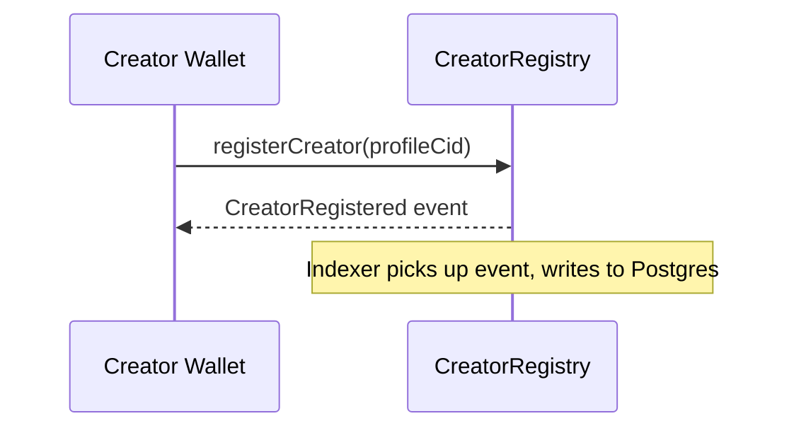
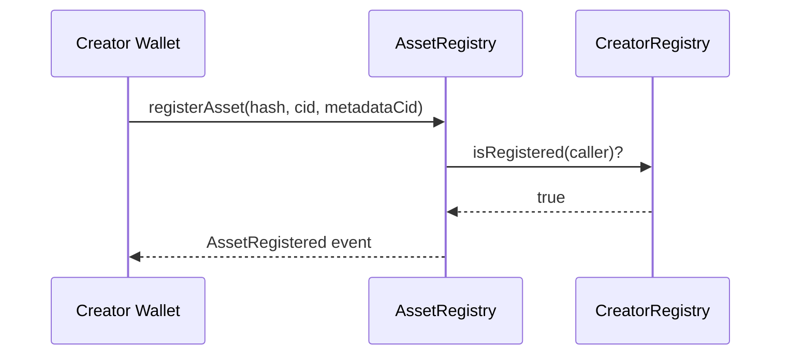
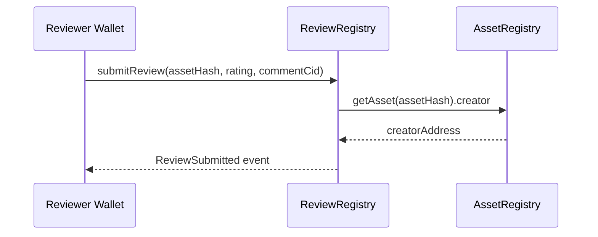
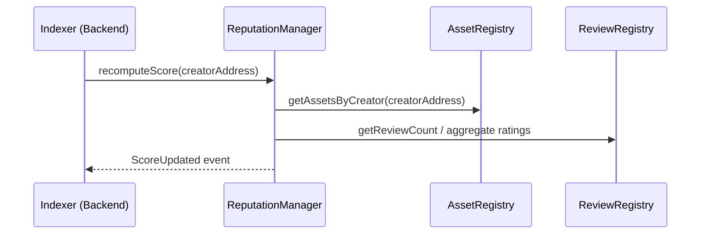
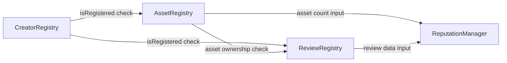

# OriginChain — Smart Contract Interfaces

Interface-only definitions for the four Arbitrum Stylus (Rust) contracts. No implementation — this is the contract the frontend and backend build against before contracts are finished.

All backend interaction with these contracts is routed through the **Blockchain Service** (`apps/backend/src/services/blockchain/`, see `DEVELOPER_KICKOFF_BLUEPRINT.md` and `REPOSITORY_STRUCTURE.md`) — no route handler or other service calls a contract directly. The frontend calls contracts directly via Wagmi/Viem for user-signed transactions (e.g. `registerAsset`), while the backend's Blockchain Service handles read calls, event listening, and any backend-initiated calls (e.g. `ReputationManager.recomputeScore`).

---

## CreatorRegistry

### Purpose
On-chain anchor for creator identity — links a wallet address to a registered creator record, independent of and more durable than the off-chain profile in Postgres.

### Storage
| Field | Type | Notes |
|---|---|---|
| creators | mapping(address → CreatorRecord) | Core registry |
| creatorCount | uint256 | Total registered creators |

`CreatorRecord`: `{ profileCid: string, registeredAt: uint64, isActive: bool }`

### Public Functions
| Function | Access | Description |
|---|---|---|
| `registerCreator(profileCid: string)` | Any wallet, once per address | Registers caller as a creator, storing the IPFS CID of their profile metadata |
| `updateProfileCid(profileCid: string)` | Only the registered creator | Updates the pointer to profile metadata |
| `getCreator(address) → CreatorRecord` | Public view | Read a creator record |
| `isRegistered(address) → bool` | Public view | Quick existence check |
| `deactivateCreator()` | Only the registered creator | Soft-deactivate (does not delete history) |

### Events
- `CreatorRegistered(address indexed creator, string profileCid, uint64 timestamp)`
- `ProfileUpdated(address indexed creator, string newProfileCid)`
- `CreatorDeactivated(address indexed creator)`

### Access Control
- Self-service only: an address can only modify its own record. No admin override in v1 — disputes are handled off-chain/socially at this stage.

### Interaction Flow

---

## AssetRegistry

### Purpose
The core proof-of-origin contract — binds a content hash to a creator address and a timestamp, immutably.

### Storage
| Field | Type | Notes |
|---|---|---|
| assets | mapping(bytes32 → AssetRecord) | Keyed by content hash |
| creatorAssets | mapping(address → bytes32[]) | Reverse index for enumeration |

`AssetRecord`: `{ creator: address, ipfsCid: string, metadataCid: string, registeredAt: uint64 }`

### Public Functions
| Function | Access | Description |
|---|---|---|
| `registerAsset(hash: bytes32, ipfsCid: string, metadataCid: string)` | Registered creators only | Registers a new asset; reverts if hash already exists |
| `getAsset(hash: bytes32) → AssetRecord` | Public view | Core verification lookup |
| `getAssetsByCreator(address) → bytes32[]` | Public view | Enumerate a creator's assets |
| `assetExists(hash: bytes32) → bool` | Public view | Cheap existence check for verification UX |

### Events
- `AssetRegistered(bytes32 indexed hash, address indexed creator, string ipfsCid, uint64 timestamp)`

### Access Control
- Caller must have `isRegistered == true` in `CreatorRegistry` (cross-contract check on registration).
- `registerAsset` reverts on hash collision — this is the entire duplicate-prevention/proof-of-priority mechanism; first registration wins.

### Interaction Flow

---

## ReviewRegistry

### Purpose
Sybil-resistant review storage — one review per registered creator per asset, referencable on-chain for reputation computation.

### Storage
| Field | Type | Notes |
|---|---|---|
| reviews | mapping(bytes32 → mapping(address → Review)) | assetHash → reviewer → review |
| reviewCount | mapping(bytes32 → uint256) | Per-asset review count |

`Review`: `{ rating: uint8, commentCid: string, timestamp: uint64 }`

### Public Functions
| Function | Access | Description |
|---|---|---|
| `submitReview(assetHash: bytes32, rating: uint8, commentCid: string)` | Registered creators only, one per asset | Reverts if reviewer already reviewed this asset, or reviewer == asset owner |
| `getReview(assetHash, reviewer) → Review` | Public view | |
| `getReviewCount(assetHash) → uint256` | Public view | |

### Events
- `ReviewSubmitted(bytes32 indexed assetHash, address indexed reviewer, uint8 rating, uint64 timestamp)`

### Access Control
- Reviewer must be a registered creator (prevents throwaway-wallet spam).
- Self-review explicitly blocked (`reviewer != AssetRegistry.getAsset(assetHash).creator`).

### Interaction Flow

---

## ReputationManager

### Purpose
Aggregates signals from the other three contracts into a single queryable reputation score per creator.

### Storage
| Field | Type | Notes |
|---|---|---|
| scores | mapping(address → uint256) | Cached computed score |
| lastComputed | mapping(address → uint64) | Timestamp of last recompute |

### Public Functions
| Function | Access | Description |
|---|---|---|
| `recomputeScore(address creator)` | Public (callable by anyone — "pull" model to avoid gas cost falling only on the creator) | Recalculates score from asset count + review aggregate, writes to storage |
| `getScore(address) → uint256` | Public view | Read cached score |

### Events
- `ScoreUpdated(address indexed creator, uint256 newScore, uint64 timestamp)`

### Access Control
- Permissionless recompute (anyone can trigger, e.g. the backend indexer after relevant events) — scoring formula itself is deterministic from on-chain data, so there's no manipulation risk in allowing open calls.

### Interaction Flow

---

## Cross-Contract Dependency Summary

**Deployment order (dependency-driven):** `CreatorRegistry` → `AssetRegistry` → `ReviewRegistry` → `ReputationManager`. Each later contract stores the address of the ones before it and calls them at execution time — deploy addresses must be recorded and wired in immediately after each deployment.
